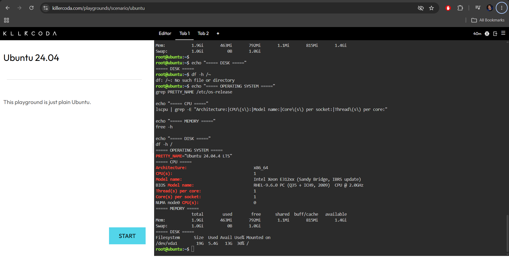

## Checkpoint 7 – Continue Your Linux Investigation

### Linux Server Information

The Linux server was investigated using the KillerCoda Playground.

#### Operating System

* **Operating System:** Ubuntu 24.04.4 LTS
* **Version Codename:** Noble Numbat
* **Architecture:** x86_64

#### CPU Information

* **CPU Model:** Intel Xeon E312xx (Sandy Bridge, IBRS update)
* **CPU(s):** 1
* **CPU Core(s):** 1
* **Thread(s) per Core:** 1
* **CPU Architecture:** x86_64
* **Virtualization:** KVM

#### Memory

* **Total Memory:** 1.9 GiB
* **Used Memory:** 465 MiB
* **Free Memory:** 791 MiB
* **Available Memory:** 1.4 GiB
* **Swap:** 1.0 GiB

#### Disk Space

The main filesystem is `/dev/vda1`, mounted on `/`.

* **Total Disk Space:** 19 GB
* **Used Space:** 5.4 GB
* **Available Space:** 13 GB
* **Disk Usage:** 30%

### Cloud Hosting Options

If this Linux server were migrated to the cloud, it could be hosted using virtual machine services from AWS, Microsoft Azure, or Google Cloud.

| Cloud Provider  | Service                | Purpose                                    |
| --------------- | ---------------------- | ------------------------------------------ |
| AWS             | Amazon EC2             | Host the Linux server as a virtual machine |
| Microsoft Azure | Azure Virtual Machines | Host the Linux server as a virtual machine |
| Google Cloud    | Compute Engine         | Host the Linux server as a virtual machine |

Amazon EC2, Azure Virtual Machines, and Google Compute Engine can all be used to host Linux-based virtual machines. These services allow organizations to run Linux workloads without maintaining the physical server hardware themselves.

### KillerCoda Screenshot

