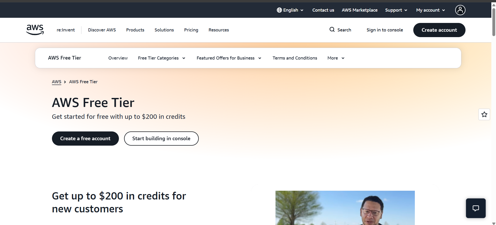

# AWS Research

## Brief Overview

Amazon Web Services (AWS) is a cloud computing platform that provides services for computing, storage, databases, networking, security, analytics, and many other IT needs. AWS began offering infrastructure services to businesses in 2006 and has grown into one of the largest cloud platforms in the world. AWS provides more than 200 services that organizations can use to build and operate applications without maintaining all of their own physical infrastructure.

## Global Infrastructure

AWS has a global infrastructure made up of geographic Regions and Availability Zones. As of 2026, AWS lists 39 geographic Regions, with multiple Availability Zones within its Regions. Availability Zones are isolated locations within a Region that help organizations design highly available applications.

## Cloud Management Console

The AWS Management Console is a web-based interface used to access and manage AWS services. Users can create resources, configure services, monitor their cloud environment, and manage their AWS account through the console.

## Four Core Services

| Category   | AWS Service | Description                                                      |
| ---------- | ----------- | ---------------------------------------------------------------- |
| Compute    | Amazon EC2  | Provides virtual servers for running applications and workloads. |
| Storage    | Amazon S3   | Provides scalable object storage for files and data.             |
| Networking | Amazon VPC  | Allows users to create isolated virtual networks in AWS.         |
| Identity   | AWS IAM     | Controls access to AWS resources and services.                   |

## Three Advantages

1. **Large service selection** – AWS provides more than 200 cloud services covering many different IT requirements.
2. **Global infrastructure** – AWS has a large worldwide infrastructure with multiple Regions and Availability Zones.
3. **Scalability** – AWS allows organizations to increase or decrease cloud resources according to their workload requirements.

## Typical Enterprise Use Cases

AWS can be used by enterprises for:

* Web and mobile application hosting
* Data storage and backup
* Database hosting
* Enterprise application migration
* E-commerce systems
* Data analytics
* Artificial Intelligence and Machine Learning
* Disaster recovery
* Global application deployment

## Screenshot

