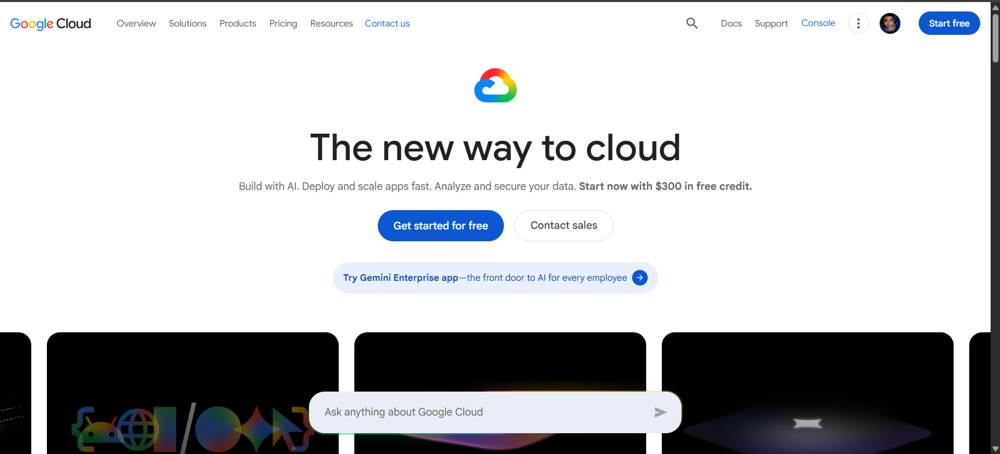

# Google Cloud Platform Research

## Brief Overview

Google Cloud is Google's cloud computing platform. It provides services for computing, storage, networking, databases, data analytics, Artificial Intelligence, Machine Learning, application development, and containerized applications.

## Global Infrastructure

Google Cloud currently provides infrastructure across 43 global regions and 130 zones. Google Cloud's network reaches more than 200 countries and territories. Its global infrastructure is designed to provide high performance, low latency, and availability for applications and services.

## Cloud Management Console

The Google Cloud Console is a web-based interface used to create, manage, configure, and monitor Google Cloud resources. It provides access to services such as Compute Engine, Cloud Storage, Kubernetes Engine, networking, databases, and IAM.

## Four Core Services

| Category   | Google Cloud Service        | Description                                                              |
| ---------- | --------------------------- | ------------------------------------------------------------------------ |
| Compute    | Compute Engine              | Provides virtual machines running on Google's infrastructure.            |
| Storage    | Cloud Storage               | Provides scalable object storage for data and files.                     |
| Networking | Virtual Private Cloud (VPC) | Provides networking capabilities for Google Cloud resources.             |
| Identity   | Cloud IAM                   | Controls access to Google Cloud resources through roles and permissions. |

Compute Engine provides virtual machines, while Google Cloud IAM provides granular access control through roles and permissions.

## Three Advantages

1. **Strong AI and Machine Learning capabilities** – Google Cloud provides a broad range of AI and ML technologies.
2. **Strong Kubernetes support** – Google Kubernetes Engine (GKE) provides a managed Kubernetes environment.
3. **Global network** – Google Cloud provides a global infrastructure with 43 regions and 130 zones.

## Typical Enterprise Use Cases

Google Cloud can be used for:

* Artificial Intelligence and Machine Learning
* Big data analytics
* Kubernetes applications
* Web application hosting
* Application modernization
* Data storage
* Database systems
* Global applications
* Containerized applications
* Research and high-performance workloads

## Screenshot

